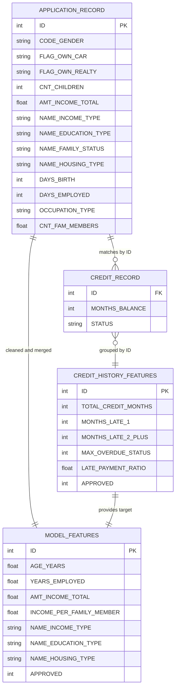

# ER Diagram

```mermaid
erDiagram
    APPLICATION_RECORD {
        int ID PK
        string CODE_GENDER
        string FLAG_OWN_CAR
        string FLAG_OWN_REALTY
        int CNT_CHILDREN
        float AMT_INCOME_TOTAL
        string NAME_INCOME_TYPE
        string NAME_EDUCATION_TYPE
        string NAME_FAMILY_STATUS
        string NAME_HOUSING_TYPE
        int DAYS_BIRTH
        int DAYS_EMPLOYED
        string OCCUPATION_TYPE
        float CNT_FAM_MEMBERS
    }

    CREDIT_RECORD {
        int ID FK
        int MONTHS_BALANCE
        string STATUS
    }

    CREDIT_HISTORY_FEATURES {
        int ID PK
        int TOTAL_CREDIT_MONTHS
        int MONTHS_LATE_1
        int MONTHS_LATE_2_PLUS
        int MAX_OVERDUE_STATUS
        float LATE_PAYMENT_RATIO
        int APPROVED
    }

    MODEL_FEATURES {
        int ID PK
        float AGE_YEARS
        float YEARS_EMPLOYED
        float AMT_INCOME_TOTAL
        float INCOME_PER_FAMILY_MEMBER
        string NAME_INCOME_TYPE
        string NAME_EDUCATION_TYPE
        string NAME_HOUSING_TYPE
        int APPROVED
    }

    APPLICATION_RECORD ||--o{ CREDIT_RECORD : "matches by ID"
    CREDIT_RECORD }o--|| CREDIT_HISTORY_FEATURES : "grouped by ID"
    APPLICATION_RECORD ||--|| MODEL_FEATURES : "cleaned and merged"
    CREDIT_HISTORY_FEATURES ||--|| MODEL_FEATURES : "provides target"
```

